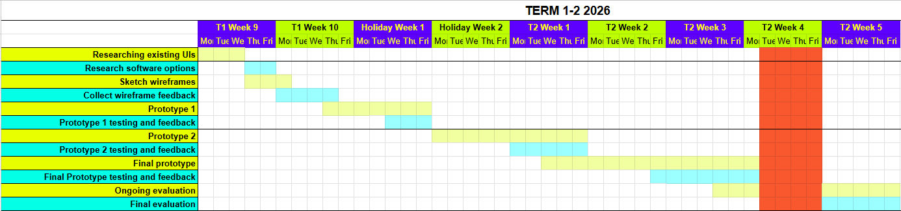
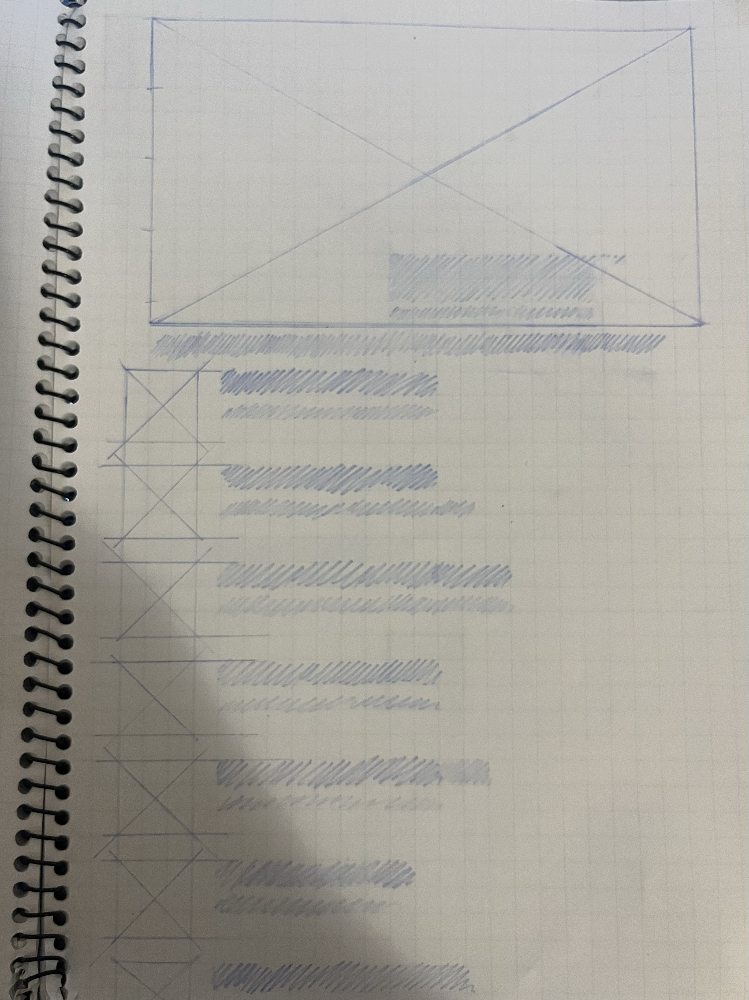
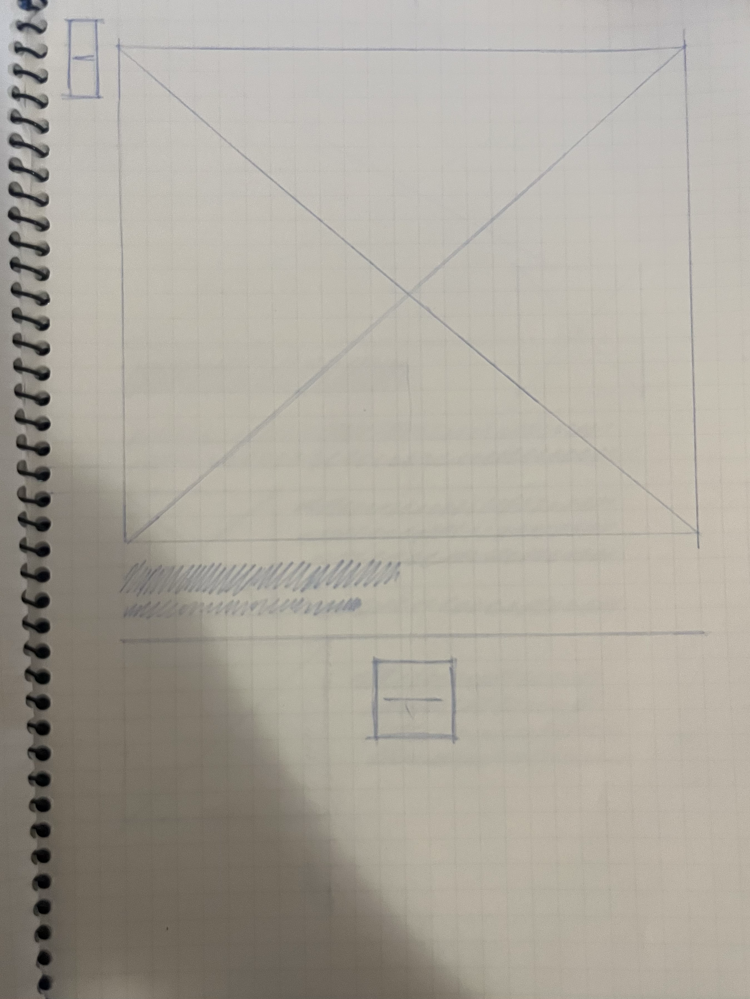
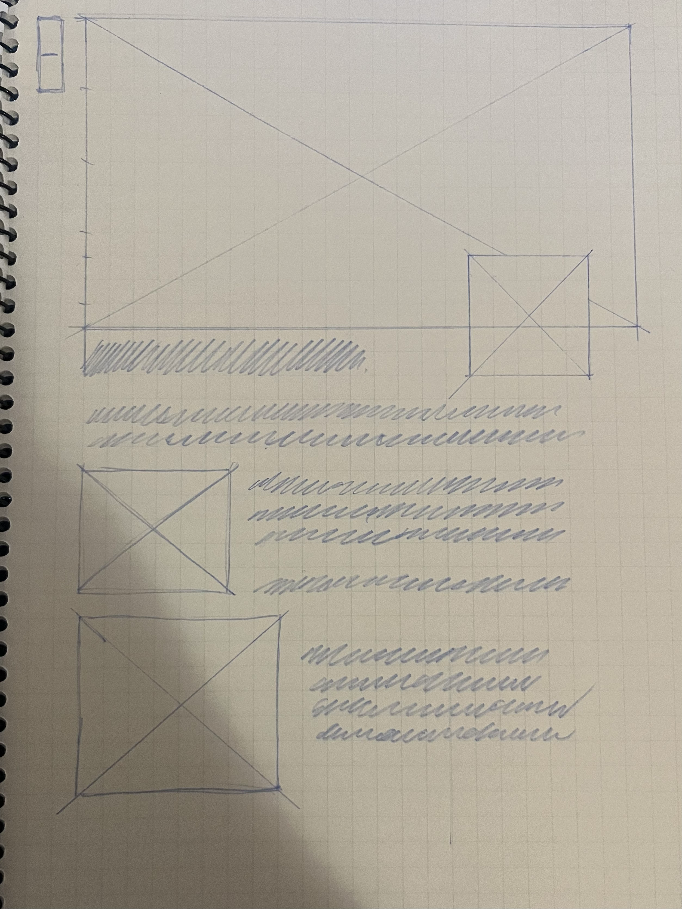
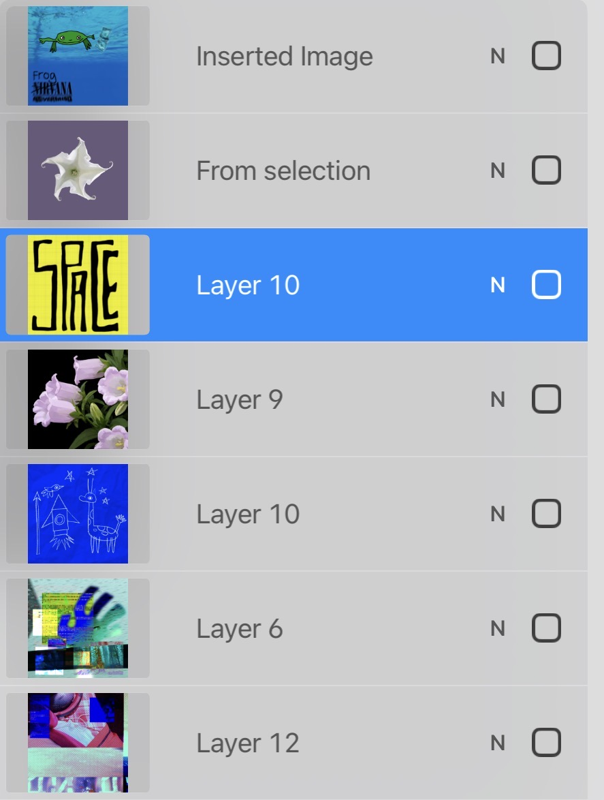
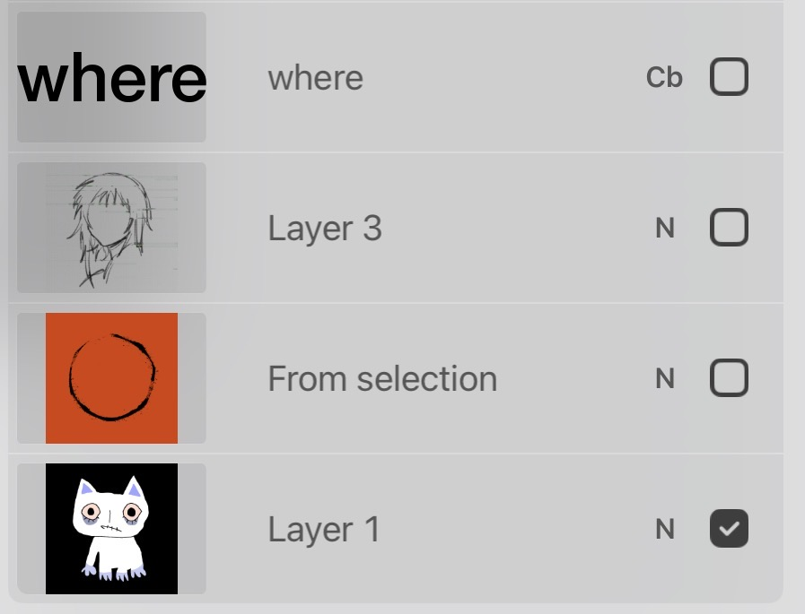
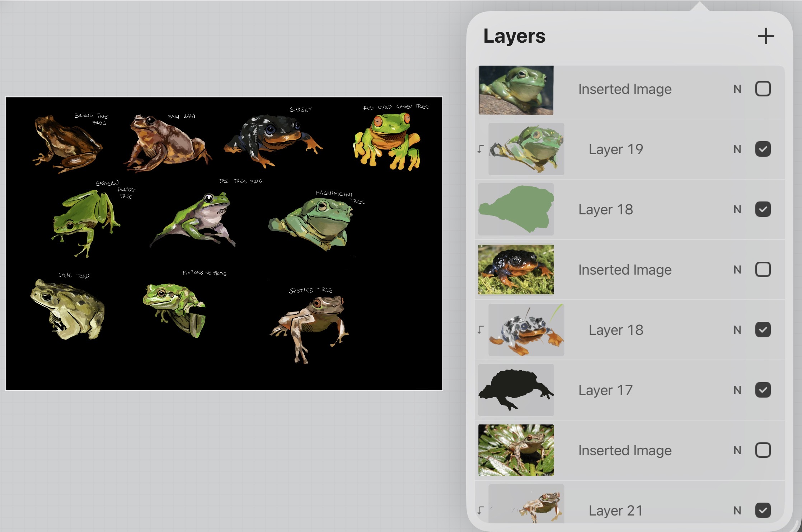
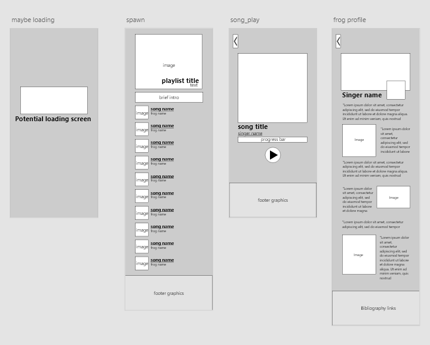
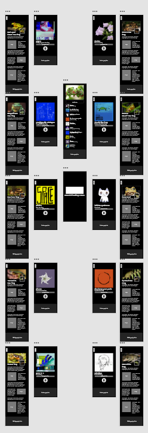

# 10CT-TASK1
Vanessa he
## Project proposal
### Design Brief
My project will be "Croakify", a Spotify inspired app that instead features frog noises in place of songs and informative short summaries under each of the frog's (singer) profiles. It will be designed for users of all ages who have a light interest in animals, offering a fun and exciting way to learn through audio, simple educational content, and interactive elements.

### Book Choice and Justification
The book I have chosen in Australian Geographic's *"A complete guide to Frogs of Australia"*, written by Simon Clulow and Mike Swan.

The encylopaedia provides a detailed and comprehesive account for all 246 recognised species and subspecies (as of 2018), including photographs, distribution maps, characteristics, reproduction, status and more. It is divided into 5 coloured categories, visible from the outer edges: Australian tree frogs, foam-nesting ground frogs, ground frogs, narrow-mouthed frogs, true frogs, and true toads. The frontmost pages outlines the contents and a brief introduction, while the back has an index and bibliography.

I chose this book after reading and returning my first option (Anomaly) because I found that the topic of frogs seemed more interesting, and would be better suited to create an experience out of overall.

### User Experience Type
My project will be an interactive app that is engaging, informative, and aesthetically pleasing. This format enhances the themes of the book by providing an immersive audio experience where users can listen to real demonstrations by Australian frogs and creates a postive learning experience for the audience. 

### Target Market
While Croakify itself is appropriate for all ages, users need to have at least primary school reading level to understand given facts and terminology. This project will appeal to the target audience because it allows users to discover and browse through diferent frog species without having to read long paragraphs of scientific text, as in the encyclopaedia.

### Software and Tools

|Chosen software and tools| Explanation |
|---|---|
| Adobe XD | Abobe XD will be used to create the main app/ interface of Croakify as I have already used Figma and would like to try a new platform. From my own experience, Figma makes it difficult integrate my own elements and postion them freely. |
| Procreate | Procreate is my main platform when developing hand drawn graphics, and allows exportation in a variety of formats. I will use it to design components such as frog pfps, song covers and the app logo. |
| Alight Motion (potentially) | Alight Motion will be used to transform transparent pngs from procreate into animated videos (eg. custom loading screen if included, perhaps animated banners), and is quite easy to use. There are also many alight motion tutorials if I am unsure of what to do. |

### Initial Brainstorming

### Chosen Idea
I chose this idea mainly because of its distinctiveness and suitability according to my timeframe and skillset. Other ideas were either too time consuming or hard to find the tutorials or resources for, which could significantly affect my final project. 
I have already used alight motion and procreate before, which allows me to focus more on developing my app functions and explore Adobe XD rather than, for example, spending too much time learning how to 3D model for a small game component (as in other ideas). 
Furthermore, I wanted to include as much information/relevance from my book as possible, given that it is factual.

## Functional Requirements

### Purpose of the Application
Croakify will inform users on a selection of Australian frogs (around 10-15, depending on time + productivity) through audio and short summaries in a structure similar to Spotify. This app will engage fans within its genre by transforming overly informative and tedious content into an interactive experience with bite sized details and statistics.

### Use Cases
Identify at least four key user actions:  
- **Selecting songs:** Upon starting the app, the user loads into a playlist where they are able to play and select songs by pressing the song title in an alphabetically arranged frog playlist. 

- **Play/Pause:** When a song is selected, the application will open the song's dedicated page, which includes a larger view of the cover, title, singer, progress bar. Under the progress bar, there will be a button that allows users to either play or pause the song. 

- **Singer (frog) profiles**: When users click the singer under the song title, they will be redirected to their profile page with key facts and visuals.

- **Back button:** Users can choose to go back to their previous page with a back button located at the top left side of the screen.

### Text Cases
- **Selecting songs:** Self testing via selecting songs while they are still playing to confirm both the audio and page changes.

- **Play/Pause:** When the pause/play button is selected, the song must stop/play within 0.2- 0.5 seconds along with the change in symbol. (triangle/parallel bars)  
This will be self tested by repeatedly clicking the pause/play button, ensuring it does not lag and responds as intended to player input.

- **Singer (frog) profiles**: 
Self testing by clicking on the singers, confirming that each profile loads/redirects correctly with accurate information and visuals.

- **Back Button:** Asking peers to press the back button for every redirection they encounter while using the app, reporting any errors.

## Non-Functional requirements

### Performance
The app will deliver smooth, reponsive interactions via simple transitions between scenes, respond to input within 0.1- 1 second (excluding loading into the app), and should not lag, glitch or display the wrong page.

### Usability
I will ensure Croakify will be easy to use by maintaining a consistent layout, colour palette, and clear, universal symbols in my buttons/interactive features. The same font, sizing, and stylisation (bold, italic, underlining) will be used throughout the app, and all text must be of and easy to read/identify.

### Reliability
Croakify will be consistent and bug-free through meticulous and regular testing of buttons, functions and correct loading of elements (either self or peer tested). All information, images and audio must be extracted from credible sources such as National Geographic and WWF, and should not includes bias or skewed data. Since my app is primarily for phones, I will examine the app across a variety of screen sizes and implement responsive resizing, ensuring that layout, text and media are to proportion and are not cut off the screen.

### Security
Croakify should not collect any information or data, and the user must stay anonymous. However, if the app were to be published and released to the public, it would include an optional log in system with a username, passcode, and email verification, allowing for stream count for each singer and song (when a unique user has listened for at least 30 seconds). I would also implement rate limiting to prevent potential bot activity and overload, encrypt sensitive user information restrict and admin access to authorised individuals.

Undergoing regular server check and maintenance would also boost security and obstruct malware and attackers.

## Social, Ethical and Legal Issues

### Social impact: Target Audience Considerations
Although the app is designed for all users, additional considerations regarding ease of use and inclusivity will be made to support users with disabilities or accessibility needs. These cover the use of high contrast colours and fonts, clear and simple navigation, appropriate spacing to avoid accidental misclicking and the minimisation of clutter or overwhelming of the screen.

### Social impact: Potential Risks and Benefits

Croakify will postively impact users by creating an enjoyable and memorable learning environment, encouraging curiosity and environmental awareness, and inspiring external engagement with conservation topics, especially in younger generations.

However, there are also several potential risks associated with the creation of the app. If information is oversimplified or becomes outdated (especially as *"Frogs of Australia"* is from 2018, information such as status will need to be rechecked), users may receive inaccurate or misleading details that could result in the mishandling of frogs, disturbance of habitats, or incorrect identification of endangered or toxic species. 
Moreover, some frogs may have cultural significance to Indigenous Australians or other communities (eg. the northern corroboree frog as a sacred totem of changing season to the Walgalu people), and using images/data without proper acknowledgement or portrayal could be perceived as disrepectful.

Since Croakify is highly audio based, users with hearing impairments will also be greatly disadvantaged.

### Ethical responsibilities: User Data and Privacy
The app will not collect user data since it does not affect it's functionality and usage, but if it was included later on, I would encrypt data via performing data minimisation, use encryption systems in both rest and transit (eg. AES- 256, TLS) and control who can access personal data, including user verification processes in changing/viewing sensitive information (passwords, user prefs and details). All collection would be transparently stated upon first registration, with clear and consistent policies, and data would be deidentified and destroyed when it is no longer needed or the account is deleted.

### Ethical responsibilities: Representation, inclusion and content sensitivity
As the app is mainly informative (exception of frog jokes), there should be no issues with representing the themes, ideas, or species from *"Frogs of Australia"*, especially as information will be only credible sources (including the book).
However, I will include a bibliography (image, videos, information) and undertake thorough external researching on cultural significance and indigenous perspectives to ensure a respectful and responsible app presentation.

### Legal considerations
Scientific data and facts are generally not copyrighted, and can be used for research or in an informative app such as Croakify without infringement. To ensure compliance with copyright laws, images, text and information will be appropriately referenced in my bibliography and rephrased as to avoid plagiarism. 
Since the audio content and some images are not my own, they must be sourced from royalty free or Creative Commons materials where possible. Recordings will be limited to around one minute or less to ensure they are used only as supporting material and do not replace the original work.

As the app will not be commercially released, fair portions of copyrighted content may be used where absolutely necessary, under Australian "fair dealing for education" provisions, assuming proper attribution and acknowledgment is given to the owners (bibliography).

If I were to expand Croakify, I would need to gain the consent to use any copyrighted materials and conduct regular audits to confirm all third party content remains compliant with its licensing terms. It would also need to include clear terms of use that outlines what users can do with the content, prohibiting copying and redistribution. A disclaimer would also be included to limit my liability if there is misuse of the app.

### Gantt chart

### Research Existing UIs

|UI Option| Plus | Minus | Implication|
|---|---|---|---|
| [Spotify](https://open.spotify.com/)| Spotify uses consistent visuals across all of its pages, including the same fonts, spacing and layouts which quickly builds user familiarity and contribute to its ease of use. Important texts and buttons are made larger and eye catching, for example, the green play button and bold "Recommended for today" selection, while the permanent bar at the bottom allows for quick and convenient navigation across its core pages. I specifically like how fluid and natural interaction in the app feels, with simple transitions between pages, an animated loading screen, and primary exploration through scrolling rather than clicking too many buttons. | I don't have anything bad to say about Spotify, probably because i'm too used to the layout. Perhaps "premium" should be removed from the bar at the bottom (home, search, library, premium, create), both because it isn't necessarily a core feature and is prone to misclicks. | Ultimately, Spotify demonstrates the importance of using a visual hierarchy in efficiently guiding users to their call to action, as well as how animations can affect usability and construct a smoother overall experience. As arguably one of the most user friendly music apps as of today, it will serve as the primary inspiration for Croakify's layout, but not without careful consideration of spacing and what features should be more readily accessible to minimise misclicks and disorganisation.
| [Oryzo](https://oryzo.ai/) | Oryzo uses a highly dynamic and interactive interface that successfully keeps the user entertained despite the large amount of information. The bright colour palette enhances its overall visual appeal as an advertisement, whereas the coffee inspired motifs reinforce the themes of the product. Moreover, the continous animation and reactive elements (eg. the coffee beans that move around your mouse) makes the experience seem more like a video than an website, creating a strong sense of immersion and strengthens engagement through real time user input and response.  | Whilst the numerous elements and animations make the website captivating, they can divert users from key content and appear overwhelming to those who prefer straightforward browsing experiences.| Although Oryzo and Croakify will have a completely different interface and  arrangement, its animations and cohesive design will still be used as a reference when developing my project. However, I will ensure that my layout prioritises clarity, usability and ease of navigation over excessive visual complexity, with effects applied to support the user experience rather than to distract from it.
|  [Yozi](https://interactive-cafe-store.vercel.app/)| Yozi simulates its cafe environment within its website via warm, stylised graphics, sound effects, and choice in background music. Upon starting the website, the user must first "enter" the cafe, where they are greeted with a watercolour replica of its interior. Users can then press on tables to view the cafe menu and select the display cabinet for images of their cakes. By mapping interactions to real objects and familiar activities, the experience is made more intuitive, and therefore memorable and easy to understand.| There isn't anything that could be improved in Yozi, apart from small details that don't have much overall impact. Maybe it could be translated into different languages to appeal to a wider audience, particularly tourists (its in Chinese), or make the screen move with the mouse since navigation does feel a little stiff.| Yozi illustrates how everyday interactions can shape the way users explore and engage with a digital experience. By recognising and implementing functions into my app based on these patterns, (using recognisable symbols and cues, eg. parallel bars for when a song playing), I can create a more intuitive interface where users generally understand how they would interact without needing instructions.
### Research Software Options

|Software Option| Plus | Minus | Implication|
|---|---|---|---|
| Adobe XD |  |
| Figma|  |
| Unity | |

### Wireframes

### Feedback

| Usability | Aesthetics | Functionality|
|---|---|---|
| "I like the back button" | "Its not cluttered so its easy to understand"| "It looks exactly like a music app so it fulfills the listening purpose"
"Maybe add a button to go straight home? " | "Its like spotify"| "What if users dont know you can press into the frogs profile"
The format is very consistent and features orderly and well-fitting" | "I like how there is always some sort of image so it doesnt look boring"

### Feedback: Evaluation
From both Yuna and Arisa's feedback, I have been able to identify key strengths and areas for improvement in my wireframes that could significantly enhance the overall user experience.  
Visually, the wireframes are clear and structural, with consistent spacing between elements and a familiar format that fosters ease of navigation and understanding. The design is very interactive and balanced in a way that contains enough information and images to be informative but still avoids overwhelming the user or appearing monotonous.

However, when it comes to usability, relying solely on a back button may be limiting, especially in situations where users have opened multiple pages or wish to quickly return home. Additionally, the ability to access the singer's profiles may not be immediately obvious to all users, such as those unfamiliar with apps like Spotify, and this issue may extend to other features within the design too.

Through this feedback, I have developed a deeper understanding of user needs and how they expect to move through the interface, particularly around the importance of clear and accessible visual cues. Moving forwards, I aim to underline clickable text (can't add hover effects for mobile) and integrate a home button below the back button if it is within my time frame.

## Producing and Implementing
### Testing and evaluating: prototype 1
Yuna Shin  
I like how the back button is really clear to see at the top. Also i really like how the play button looks like - it looks satisfying and feels good to click cause its big. Easy to navigate without any extra information and i like how the things you click to move on the the next pages are underlined so you won't have to worry and think about what to click. Foot graphics - good, i like it. I also like how they all look the smae its like satisfying to see 

Probably should have like a button so that you can come from the singer name back the home screen straight away?? Makeks it easier cause then I dont have to click an extra time. I also like how the big the images are, 

Arisa -
It's very structured and intuitive as its similar to spotify and a lot of music apps which improves user navigation
the song photos are very aesthetically pleasing and i like the nirvana frog its so touchable
the transition between clicking the song and going to the song is very smooth and makes the ui really satisfying
i love the buttons its so nice
maybe add logo or the app name at the tippy top of the main screen? i kind of hate the gray it clashes with a lot of the song covers otherwise its perfect i loveee

### Ongoing evaluation: Week 1

This week, I made and finished my first prototype, using rectangles instead of buttons and images, and with a simple grey coloured background, which I plan to change later. I made one template 

### Testing and evaluating: prototype 2

### Ongoing evaluation: Week 2

### Ongoing evaluation: Week 3

Yuna
I like the pictures (high quality) and very sturcutred, easy to navigate i also really like the loadig screen. I like the drawings and how each page looks the same so it isnt too overhwleming. Big arrow button so easy to see. I like how each page is structured so thats its not too boring but not that decorated and over the top euither. Mayeb you need a logo so that they can get from the information page back to the start in one go and not press the back button twice ?? (idk). also why is the play button already on play.  i dont like that. why is it playihng before i even press anything. what if im outside and my phones on full volume. i like the names too but jayeb too big compared to the actuall bnames> or like maybe write how it is linekd to the actual frog in the description or smth cause it seems ireelavant.

arisa
i like the transitions
I LOVE THE SONG ART its so pretty and i like how each song is like a reference to some artist in real life it definitely improvers user interaction with the program
the 'artist info' frog thing the layout is really pretty and i like how they have a long panel and a profile photo and the outline on the profile adds clarity
\maybe the back button should be locked to the page when u scroll so its more accessible and im a lazy bum + maybe fill the arrow cus like ur pause button is filled black so ur back arrow should be filled as well for consistency
the transition times for each song is different make it consistent but i like that u added transitions it definitely elevates the user experience
i think u should have a title or something logo or whatever on ur playlist page
i like that u have a loading screen
the black makes it very sleek and definitely made ur ui look prettier

