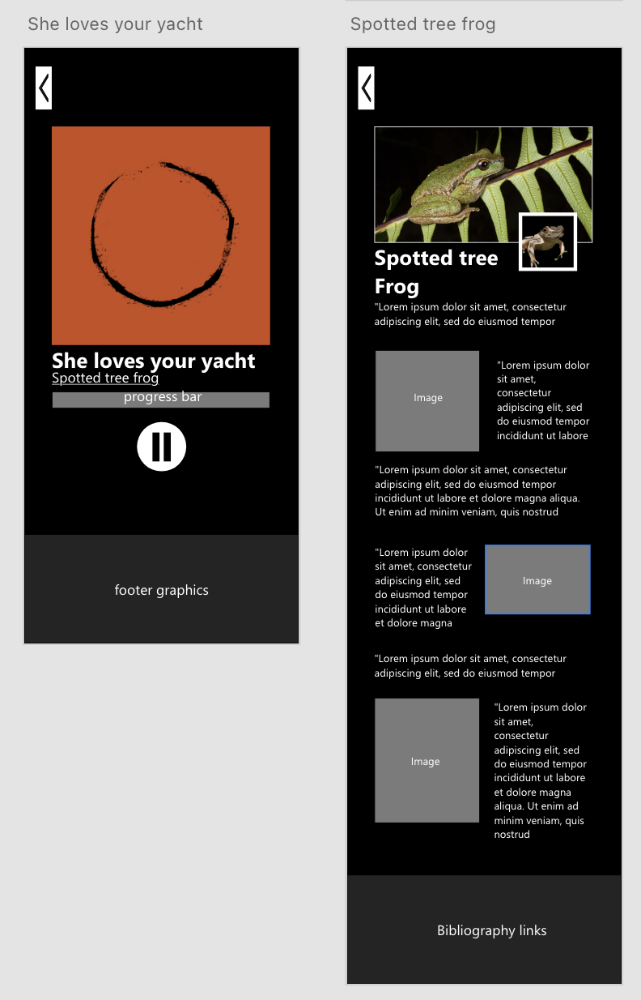
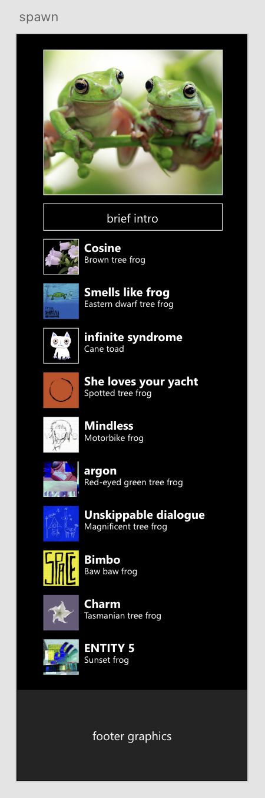
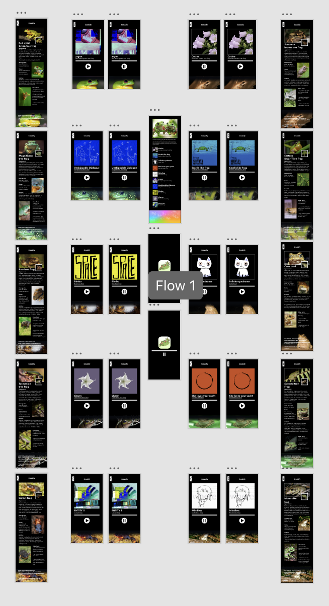
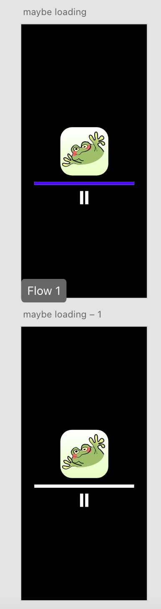
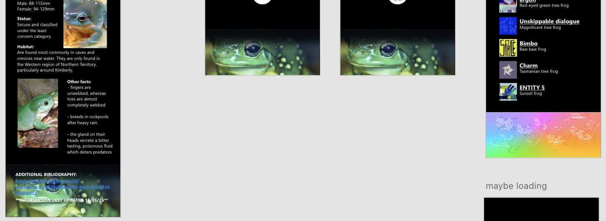
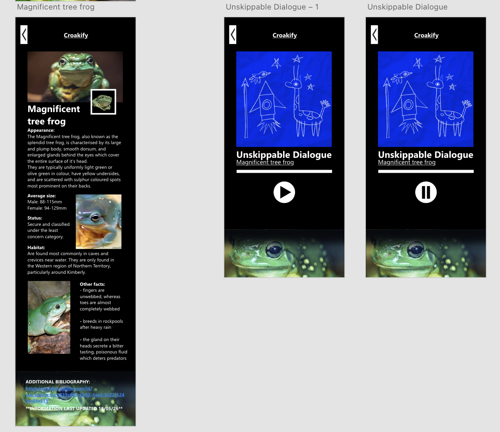
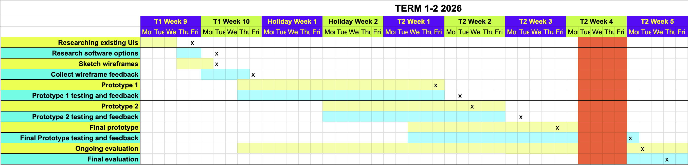

# 10CT-TASK1
Vanessa he
## Project proposal
### Design Brief
My project will be "Croakify", a Spotify inspired app that instead features frog noises in place of songs and informative short summaries under each of the frog's (singer) profiles. It will be designed for users of all ages who have a light interest in animals, offering a fun and exciting way to learn through audio, simple educational content, and interactive elements.

### Book Choice and Justification
The book I have chosen in Australian Geographic's *"A complete guide to Frogs of Australia"*, written by Simon Clulow and Mike Swan.

The encylopaedia provides a detailed and comprehesive account for all 246 recognised species and subspecies (as of 2018), including photographs, distribution maps, characteristics, reproduction, status and more. It is divided into 5 coloured categories, visible from the outer edges: Australian tree frogs, foam-nesting ground frogs, ground frogs, narrow-mouthed frogs, true frogs, and true toads. The frontmost pages outlines the contents and a brief introduction, while the back has an index and bibliography.

I chose this book after reading and returning my first option (Anomaly) because I found that the topic of frogs seemed more interesting, and would be better suited to create an experience out of overall.

### User Experience Type
My project will be an interactive app that is engaging, informative, and aesthetically pleasing. This format enhances the themes of the book by providing an immersive audio experience where users can listen to real demonstrations by Australian frogs and creates a postive learning experience for the audience. 

### Target Market
While Croakify itself is appropriate for all ages, users need to have at least primary school reading level to understand given facts and terminology. This project will appeal to the target audience because it allows users to discover and browse through diferent frog species without having to read long paragraphs of scientific text, as in the encyclopaedia.

### Software and Tools

|Chosen software and tools| Explanation |
|---|---|
| Adobe XD | Abobe XD will be used to create the main app/ interface of Croakify as I have already used Figma and would like to try a new platform. From my own experience, Figma makes it difficult integrate my own elements and postion them freely. |
| Procreate | Procreate is my main platform when developing hand drawn graphics, and allows exportation in a variety of formats. I will use it to design components such as frog pfps, song covers and the app logo. |
| Alight Motion (potentially) | Alight Motion will be used to transform transparent pngs from procreate into animated videos (eg. custom loading screen if included, perhaps animated banners), and is quite easy to use. There are also many alight motion tutorials if I am unsure of what to do. |

### Initial Brainstorming

### Chosen Idea
I chose this idea mainly because of its distinctiveness and suitability according to my timeframe and skillset. Other ideas were either too time consuming or hard to find the tutorials or resources for, which could significantly affect my final project. 
I have already used alight motion and procreate before, which allows me to focus more on developing my app functions and explore Adobe XD rather than, for example, spending too much time learning how to 3D model for a small game component (as in other ideas). 
Furthermore, I wanted to include as much information/relevance from my book as possible, given that it is factual.

## Functional Requirements

### Purpose of the Application
Croakify will inform users on a selection of Australian frogs (around 10-15, depending on time + productivity) through audio and short summaries in a structure similar to Spotify. This app will engage fans within its genre by transforming overly informative and tedious content into an interactive experience with bite sized details and statistics.

### Use Cases
Identify at least four key user actions:  
- **Selecting songs:** Upon starting the app, the user loads into a playlist where they are able to play and select songs by pressing the song title in an alphabetically arranged frog playlist. 

- **Play/Pause:** When a song is selected, the application will open the song's dedicated page, which includes a larger view of the cover, title, singer, progress bar. Under the progress bar, there will be a button that allows users to either play or pause the song. 

- **Singer (frog) profiles**: When users click the singer under the song title, they will be redirected to their profile page with key facts and visuals.

- **Back button:** Users can choose to go back to their previous page with a back button located at the top left side of the screen.

### Text Cases
- **Selecting songs:** Self testing via selecting songs while they are still playing to confirm both the audio and page changes.

- **Play/Pause:** When the pause/play button is selected, the song must stop/play within 0.2- 0.5 seconds along with the change in symbol. (triangle/parallel bars)  
This will be self tested by repeatedly clicking the pause/play button, ensuring it does not lag and responds as intended to player input.

- **Singer (frog) profiles**: 
Self testing by clicking on the singers, confirming that each profile loads/redirects correctly with accurate information and visuals.

- **Back Button:** Asking peers to press the back button for every redirection they encounter while using the app, reporting any errors.

## Non-Functional requirements

### Performance
The app will deliver smooth, responsive interactions via simple transitions between scenes, respond to input within 0.1- 1 second (excluding loading into the app), and should not lag, glitch or display the wrong page.

### Usability
I will ensure Croakify will be easy to use by maintaining a consistent layout, colour palette, and clear, universal symbols in my buttons/interactive features. The same font, sizing, and stylisation (bold, italic, underlining) will be used throughout the app, and all text must be of and easy to read/identify.

### Reliability
Croakify will be consistent and bug-free through meticulous and regular testing of buttons, functions and correct loading of elements (either self or peer tested). All information, images and audio must be extracted from credible sources such as National Geographic and WWF, and should not includes bias or skewed data. Since my app is primarily for phones, I will examine the app across a variety of screen sizes and implement responsive resizing, ensuring that layout, text and media are to proportion and are not cut off the screen.

### Security
Croakify should not collect any information or data, and the user must stay anonymous. However, if the app were to be published and released to the public, it would include an optional log in system with a username, passcode, and email verification, allowing for stream count for each singer and song (when a unique user has listened for at least 30 seconds). I would also implement rate limiting to prevent potential bot activity and overload, encrypt sensitive user information restrict and admin access to authorised individuals.

Undergoing regular server check and maintenance would also boost security and obstruct malware and attackers.

## Social, Ethical and Legal Issues

### Social impact: Target Audience Considerations
Although the app is designed for all users, additional considerations regarding ease of use and inclusivity will be made to support users with disabilities or accessibility needs. These cover the use of high contrast colours and fonts, clear and simple navigation, appropriate spacing to avoid accidental misclicking and the minimisation of clutter or overwhelming of the screen.

### Social impact: Potential Risks and Benefits

Croakify will postively impact users by creating an enjoyable and memorable learning environment, encouraging curiosity and environmental awareness, and inspiring external engagement with conservation topics, especially in younger generations.

However, there are also several potential risks associated with the creation of the app. If information is oversimplified or becomes outdated (especially as *"Frogs of Australia"* is from 2018, information such as status will need to be rechecked, and there will need to be a date of last edit disclaimer), users may receive inaccurate or misleading details that could result in the mishandling of frogs, disturbance of habitats, or incorrect identification of endangered or toxic species. 
Moreover, some frogs may have cultural significance to Indigenous Australians or other communities (eg. the northern corroboree frog as a sacred totem of changing season to the Walgalu people), and using images/data without proper acknowledgement or portrayal could be perceived as disrepectful.

Since Croakify is highly audio based, users with hearing impairments will also be greatly disadvantaged.

### Ethical responsibilities: User Data and Privacy
The app will not collect user data since it does not affect it's functionality and usage, but if it was included later on, I would encrypt data via performing data minimisation, use encryption systems in both rest and transit (eg. AES- 256, TLS) and control who can access personal data, including user verification processes in changing/viewing sensitive information (passwords, user prefs and details). All collection would be transparently stated upon first registration, with clear and consistent policies, and data would be deidentified and destroyed when it is no longer needed or the account is deleted.

### Ethical responsibilities: Representation, inclusion and content sensitivity
As the app is mainly informative (exception of frog jokes), there should be no issues with representing the themes, ideas, or species from *"Frogs of Australia"*, especially as information will only be from credible sources (including the book).
However, I will include a bibliography (image, videos, information) and undertake thorough external research on cultural significance and indigenous perspectives to ensure a respectful and responsible app presentation.

### Legal considerations
Scientific data and facts are generally not copyrighted, and can be used for research or in an informative app such as Croakify without infringement. To ensure compliance with copyright laws, images, text and information will be appropriately referenced in my bibliography and rephrased as to avoid plagiarism. 
Since the audio content and some images are not my own, they must be sourced from royalty free or Creative Commons materials where possible. Recordings will be limited to around one minute or less to ensure they are used only as supporting material and do not replace the original work.

As the app will not be commercially released, fair portions of copyrighted content may be used where absolutely necessary, under Australian "fair dealing for education" provisions, assuming proper attribution and acknowledgment is given to the owners (bibliography).

If I were to expand Croakify, I would need to gain the consent to use any copyrighted materials and conduct regular audits to confirm all third party content remains compliant with its licensing terms. It would also need to include clear terms of use that outlines what users can do with the content, prohibiting copying and redistribution. A disclaimer would also be included to limit my liability if there is misuse of the app.

### Gantt chart

### Research Existing UIs

|UI Option| Plus | Minus | Implication|
|---|---|---|---|
| [Spotify](https://open.spotify.com/)| Spotify uses consistent visuals across all of its pages, including the same fonts, spacing and layouts which quickly builds user familiarity and contribute to its ease of use. Important texts and buttons are made larger and eye catching, for example, the green play button and bold "Recommended for today" selection, while the permanent bar at the bottom allows for quick and convenient navigation across its core pages. I specifically like how fluid and natural interaction in the app feels, with simple transitions between pages, an animated loading screen, and primary exploration through scrolling rather than clicking too many buttons. | I don't have anything bad to say about Spotify, probably because i'm too used to the layout. Perhaps "premium" should be removed from the bar at the bottom (home, search, library, premium, create), both because it isn't necessarily a core feature and is prone to misclicks. | Ultimately, Spotify demonstrates the importance of using a visual hierarchy in efficiently guiding users to their call to action, as well as how animations can affect usability and construct a smoother overall experience. As arguably one of the most user friendly music apps as of today, it will serve as the primary inspiration for Croakify's layout, but not without careful consideration of spacing and what features should be more readily accessible to minimise misclicks and disorganisation.
| [Oryzo](https://oryzo.ai/) | Oryzo uses a highly dynamic and interactive interface that successfully keeps the user entertained despite the large amount of information. The bright colour palette enhances its overall visual appeal as an advertisement, whereas the coffee inspired motifs reinforce the themes of the product. Moreover, the continous animation and reactive elements (eg. the coffee beans that move around your mouse) makes the experience seem more like a video than an website, creating a strong sense of immersion and strengthens engagement through real time user input and response.  | Whilst the numerous elements and animations make the website captivating, they can divert users from key content and appear overwhelming to those who prefer straightforward browsing experiences.| Although Oryzo and Croakify will have a completely different interface and  arrangement, its animations and cohesive design will still be used as a reference when developing my project. However, I will ensure that my layout prioritises clarity, usability and ease of navigation over excessive visual complexity, with effects applied to support the user experience rather than to distract from it.
|  [Yozi](https://interactive-cafe-store.vercel.app/)| Yozi simulates its cafe environment within its website via warm, stylised graphics, sound effects, and choice in background music. Upon starting the website, the user must first "enter" the cafe, where they are greeted with a watercolour replica of its interior. Users can then press on tables to view the cafe menu and select the display cabinet for images of their cakes. By mapping interactions to real objects and familiar activities, the experience is made more intuitive, and therefore memorable and easy to understand.| There isn't anything that could be improved in Yozi, apart from small details that don't have much overall impact. Maybe it could be translated into different languages to appeal to a wider audience, particularly tourists (its in Chinese), or make the screen move with the mouse since navigation does feel a little stiff.| Yozi illustrates how everyday interactions can shape the way users explore and engage with a digital experience. By recognising and implementing functions into my app based on these patterns, (using recognisable symbols and cues, eg. parallel bars for when a song playing), I can create a more intuitive interface where users generally understand how they would interact without needing instructions.
### Research Software Options

|Software Option| Plus | Minus | Implication|
|---|---|---|---|
| Adobe XD | Adobe XD offers a variety of intuitive features and beginner friendly aspects such as drag and drop components, repeat grids and real time previews which allow for efficient and fast paced design processes. Basic animations and functions such as response to different inputs and screen transitions are also included presets within the prototype menu, so that users can create engaging interactive elements without needing to code. Furthermore, the layout and interface of the app follows a similar structure to other Adobe products I have previously used (AI, AP, ID), and should be relatively easy to learn.| As adobe XD is discontinued, it has limited future updates, support, and feature development, which can make it harder to create large scale projects that require new and emerging tools to keep up with market competitors. Users also report frequent lag in projects with many artboards and assets.| Adobe XD would be the most suitable software option for my project as there are many tutorials online explaining similar functions also used within my app (incuding the ones provided in class), while its straightfoward interface and protyping tools allow for professional looking results with minimal difficulty and experience. While it is discontinued, the existing features should be enough in making my project, and I don't think I will look to expand it in the future. 
| Canva| Canva includes a wide selection of design assets, preset elements, templates and editing tools that make it easy and quick to create visually appealing products. Notably, it presents built in brand kit features that allow users to maintain consistent colour palettes, fonts, sizing, and stylisation across one or multiple projects, and free premium services for students. As I am already familiar with Canva, I will not need much external research if I choose to pursue this software.| Canva is mainly focused on graphic design rather than fully functional prototyping, so interactive features and tools are extremely limited compared to specialised applications.| Canva would be userful for creating simple interfaces and graphic mockups due to its ease of use and large component library, but because my project requires more proficient prototyping, for example, time triggered responses, Canva  would not be able to provide enough functionality to produce my app, and will therefore not be used. 
| Figma | Figma provides powerful UI and prototyping tools, with features such as reusable components, auto layout, interactive prototyping modes, and a range of plugins/community resources that can help users speed up workflow and create sophisticated projects. Since it runs on browser as well as a desktop app, it is easy to access and share work, and it saves automatically in real time, ensuring no work is lost in battery drains or crashes.| Figma can feel overwhelming for new users due to the large number of tools and elements which may require more time and practice to learn. Additionally, many useres claim initial navigation is difficult, especailly with finding hidden settings, responding to vague error notifications, and dynamic menus.| Using Figma would provide access to advances prototyping and design elements that could overall improve the quality and detail of my final product, however, the steeper learning curve may slow down development and make it harder to complete my project in the given time frame, making it an unsuitable option.
### Wireframes

### Feedback

| Usability | Aesthetics | Functionality|
|---|---|---|
| "I like the back button" | "Its not cluttered so its easy to understand"| "It looks exactly like a music app so it fulfills the listening purpose"
"Maybe add a button to go straight home? " | "Its like spotify"| "What if users dont know you can press into the frogs profile"
The format is very consistent and features orderly and well-fitting" | "I like how there is always some sort of image so it doesnt look boring"

### Feedback: Evaluation
From both Yuna and Arisa's feedback, I have been able to identify key strengths and areas for improvement in my wireframes that could significantly enhance the overall user experience.  
Visually, the wireframes are clear and structural, with consistent spacing between elements and a familiar format that fosters ease of navigation and understanding. The design is very interactive and balanced in a way that contains enough information and images to be informative but still avoids overwhelming the user or appearing monotonous. 

However, when it comes to usability, relying solely on a back button may be limiting, especially in situations where users have opened multiple pages or wish to quickly return home. Additionally, the ability to access the singer's profiles may not be immediately obvious to all users, such as those unfamiliar with apps like Spotify, and this issue may extend to other features within the design too.

Through this feedback, I have developed a deeper understanding of user needs and how they expect to move through the interface, particularly around the importance of clear and accessible visual cues. Moving forwards, I aim to underline clickable text (can't add hover effects for mobile) and integrate a home button below the back button if it is within my time frame.

## Producing and Implementing
### Ongoing evaluation: Week 1

This week, I drew/collaged (layer 6+12) all of my frog pfps (realistic) and album covers in procreate, and made/finished my first prototype. This prototype does not have any images, colour or meaningful text, but includes the basic animations and interactions, such as scrolling the playlist, clicking into the songs, clicking into a singer, and a functional play button and back button. I only made one testing slide, which I will need to duplicate later.

The only challenge I really encountered was making the pause/play button a state, because if I put them on two artboard and linked them together, the user would have to press the back button twice to their real previous page. I resolved this by searching google adobe xd tutorials, which helped me understand how states work and how I should go making one.

I also didn't expect an iphone to be so long when I drew my wireframes, so I added extra footer graphics/space on every page (except for the loading). This would be my most important design choice of this week, as now I have a place to put my bibliography.

songs + playlist -> footer graphics
profile -> bibliography over footer graphics 

I aim to complete each prototype in a week, so I think my project managment so far is great, but I spent way longer drawing than I thought. If I were to draw more graphics in the future, I should reserve more time.

Next week, I want have all my artboards, pick my colour palette, add images, and put down all my text except for the information. I should also make a google doc where I can put my reference links and type up my draft profiles.

### Testing and evaluating: prototype 1
| Evaluator| Positive | Negative|
| -------- | -------- | ------- |
| Yuna | "the play button looks satisfying and feels good to click because it is big"| "I want a home button because I'm lazy to click twice"|| "I like how interactive elements are underlined so I know what to press"
|| "I like how the footer graphics are consistent is size"
|| "Its very pretty and interactive" | 
| Arisa | "Its like spotify and a lot of music apps which improves user navigation"| "Its a lot of clicking"
|| "aesthetically pleasing"|
|| "satisfying transitions and buttons"| 

### Feedback Analysis: prototype 1
From the feedback I have collected, I can deduce that my project is generally moving in a postive direction, though there are still problems that need to be addressed. While users found the prototype visually appealing and engaging, particularly the sizing/consistency of elements and "satisfying" transitions, navigation was found to be inefficient without a home button. 
Although this was a recurring suggestion in my wireframes, there is not much space in my artboard, and placing it beside or under the back button would make the layout feel cluttered and less visually cohesive.

In the future, my project's navigation should be rethought in a way that doesn't reduce usability, and I will need to explore alternative layouts or a more efficient system where users can directly return home more easily and naturally within the interface. 
### Ongoing evaluation: Week 2

This week, I duplicated my song and profile artboards ten times for each song, and made sure they all linked to their corresponding frogs. I also pasted all my drawings and added banners, which I linked in the promised google doc (from last week). 

Although I didn't do much this time, choosing a colour palette was excessively hard. Initially, I had wanted to go for a dark blue or a green, so it didn't look too much like Spotify, but in the end, I still chose black. Every other option either didn't suit the colour palette, was too harsh on the eyes, or looked incohesive overall. Black was proven to be the safest and most neutral option. 

I also added hover effects before realising it was a mobile app and had to delete everything.

I didn't encounter any problems, but discovered that if you dragged an image over a shape, it would clip into it and allow for easy adjustment. This however, does not work for copy/paste. I used this technique to ensure all my images were consistent in size and placement.

Again, my time and workflow was great, since I completed it before my expected deadline. I think I only worked on this once at home. I could have started my third prototype, but didn't because I was lazy. I might come to regret this later. 

Next week, I aim to wrap up my whole project so I have more time to work on theory. This includes my loading screen (which I have come to keep), drawing my logo and footers, making a progress bar, importing my frog sounds, and writing up my frog profile information. I feel like I can complete this in time, but writing could take a long time.

### Testing and evaluating: prototype 2

| Evaluator| Positive | Negative|
| -------- | -------- | ------- |
| Yuna | "high quality images and drawings"|"Do you have a logo?"
||"easy to navigate"| "It would be nice to have a direct home button"
||  "each page is consistent and not overwhelming or boring"||
||"appropriately decorated"||
||"buttons are familiar and easy to find"||
| Arisa | "I like the transitions"|"maybe the back button should be locked"
||  "I like the song art"|"you should have a title or logo to tell the user what the app is"
|| "I like the outline on images that blend into the backgroud for clarity"|"add a home button"
|| "some songs are real life references that improves user engagement"||
|| "frog information is very structured and easy to understand"||
| Emma | "smooth transitions"| "you havent put the bibliography yet but I suggest you make it into a hyperlink so its clickable||
||"its very aesthetically pleasing"|"maybe reunderline the song names"

### Feedback Analysis: prototype 2
The user feedback received provided powerful insights on both positive aspects of my project, and areas that may need more improvement. Visual presentation and user engagement were again highlighted among the strongest features, with users responding positively to the overall aesthetics, consistency and smooth transitions.
However, navigation and branding was indicated as a weak suit. I had not yet finalised where my home button should go, which is why it was not included at this stage. In addition, the app name, introduction and underlined song titles were accidentally deleted during development, and without user feedback, would have remained unnoticed in my design process.

There were also smaller suggestions such as making the future bibliography a hyperlink to improve accessibility as ease of use.

In my final prototype, I should focus on reinstalling the missing elements, confirm the placement of the home button, and implement the suggested refinements in order to enhance overall user friendliness and functionality.

### Ongoing evaluation: Week 3

This week, I finally finished my project.

**Footers:**

I drew up the footer in procreate, but thought using the same footer image for every artboard woul seem repetitive. I decided on only using the drawn one on the main screen, and pictures of the corresponding frog for the rest. 
The fade effects were also transparent pngs from procreate.

**Frog sounds/music:**

Through a youtube tutorial, I found that I cannot create real playback audio controls on Adobe XD, and it only supports basic functions and transitions.

This means that I can't I can't have my play/pause song on one artboard, song progress will not save (pressing pause then play again will reset the song to the start), and pressing into the frog's profiles will stop the music. 

To compromise, I separated the pause and play into two artboards, where "play_artboard" will have the music, and "pause_artboard" will have no music. 

This presents the problem I wanted to avoid earlier by using one artboard only. 
The user will have to press back twice to get to their real previous page (due to two artboards).

After a while, I realised the back function on any song slide can only lead to home, which fixes my whole issue.
Instead of setting both button's action to "previous page", I could set it to "home" instead.

Each audio file has also been through a normalisation website to guarantee they have similar raw volumes. 

**Loading screen:**

For the loading screen, I decided to keep it simple and have it show the app logo, and a loading bar which would match the progress bars in my songs. 

After I drew my logo, I watched a progress bar youtube tutorial, and overall, completed it within an hour (including drawing).

**Progress bar:**

I thought I could reuse the same approach to make the progress bar as the loading screen progress bar, but the specific animation's maximum duration was 1 second, and you couldn't use a time function twice on the same slide (taken by music). 

The only other alternative I could think of was making a replica on alight motion, and pasting the video in, except without playback on "pause_artboard"(since adobe can't remember song progress anyways).

I had planned to export a new video for every song, since they are all different lengths (alight motion is ad per export and inefficient to use), but later found a website called [Ezgif](https://ezgif.com/video-speed/ezgif-3b2202eb5af08169.mp4.html) that could speed up the video according to how long the target end time is.
This helped me cut corners and overall, is the only reason I completed this protoype in a week. 

For some reason, XD shrinks the progress bar video when it plays, but I could not find any reason why, especially as the no playback version of the same video is unaffected. This will not impact my project too much, so I decided to just leave it and move on.

**Home shortcut:**

Previously, I had said that I would make a home shortcut button under the back button if I had time at the end. But because of Arisa and Yuna's constant feedback and recommendation, I incorporated "Croakify" on the top of each page (except home) serve both as a shortcut and as a watermark. Spotify also has this function, but I had no idea until it was added into my own app.

**Information:**

I typed all my information in a google doc referencing my book and other credible sources including national geographic, museum sites, FrogId, and IUCN listings, and pasted them into my project. The bibliography is a hyperlink and the playlist has a title and short info section!!

## Final Evaluation
### Functional and Non-functional requirements:
I believe Croakify sufficiently meets most of its functional and nonfunctional requirements while while successfully serving as an educational music app that makes information more engaging and enjoyable for users to consume.

In terms of functional requirements, users are able to select frog "songs", play and pause audio, access frog profile pages, and use both the back and later added home button to efficiently navigate between artboards. The expected behaviours were achieved in my final product, as audio playback, buttons and pages responded as intended with correctly displayed visuals and information. However, songs were not arranged alphabetically as originally planned, as I overlookied implementing this feature during development as a result of not thoroughly reviewing my requirements beforehand. This slightly reduces the convenience and usability of Croakify as a large part of my application, and users would need to become familiar to playlist ordering to locate specific songs/frogs more easily.

Non functionally, Croakify maintains a consistent layout, colour palette, font style, and button design, making navigation clear and intuitive for users. Performance met expectations with smooth transitions and responses without lag during testing. Reliability was also maintained via the use of credible sources and consideration of accuracy and relevance. However, this could have been further supported through gathering feedback from a more diverse audience to better understand different user needs, as well as conducting responsive testing across various phone sizes, which I did not have the means or resources for. This may affect the consistency and appearance of layouts, text and media, ultimately altering the overall user experience on certain devices.  

### Design brief:
My final product effectively meets the intentions outlined in my design brief as an engaging Spotify inspired platform that translates traditional educational content into a more interactive and accessible experience using audio and visual elements, making it more appealing to the general audience than monotonous, text heavy resources. 
Despite this, the frog profile summaries came out to be longer and more information dense than originally intended, so it may not appeal as strongly to younger audiences who were a large part of my target market. However, this increased detail does enhance the educational value and should not hinder its collective usability or success as an app, as the core structure, navigation and interactivity remains exciting for users. 

### Social, Ethical and Legal responsibilities:
I feel that my project manages social, ethical and legal responsibilities to a considerable extent. Accessibility needs were addressed to the best of my ability through the use of high contrast colours, clear navigation, appropriate sizing/spacing and simple, uncluttered layout to improve usability and reduce overstimulation.
Ethically, I managed to only use credible and reliable sources. and avoided including frogs or content that could have cultural significance requiring external consultation, which helped to ensure respectful representation.

Conversely, from a legal standpoint, I could have incorporated more precise referencing in my information, such as numbered footnotes to strengthen traceability incase of inaccurate information and reliability. Moreover, my disclaimer at the bottom, "ALL INFORMATION AS OF 2026", should have a specific date instead of a year, as frog statuses or other data may change over the period of just months.

### Time, resources and processes:

I believe I managed my time, resources, and processed quite effectively throught the project, with generally consistent progress and completion of most milestones within planned timeframes overall.
I also adapted reasonably well to challenges that arose during development, particularly around the limitations of Adobe Xd and what it meant for my project. Some features did not work as well as others (shrinking progress bar), or could not be prototyped the way I initially assumed (back button, progress bar through alight motion), meaning I had to constantly find workaround and adjust certain designs to fit within its capabilities. 

Nontheless, there were still areas that could have been improved. I should have made my gantt chart more ambitious, as I would finish the allocated work early and then wait until the following week to begin my next set of tasks. Because the chart was packed tight, it left little to no extra time for unexpected issues or last minute polishing. I could have also worked on creating my prototypes in the holidays to reduce pressure during the school term and further save time.

### Gathering and responding to user feedback + possible improvements:
Although I believe that I have responded to user feedback adequately, taking suggestions into consideration and making appropriate changes, there could have been more effort in gathering user feedback.

I had only asked users for positive/negative aspects and areas for improvement, which may have influenced their responses as they were not given more specific guidance on what to comment and make a judgement on.
Additonally, feedback was only gathered from three people in total throughout the process, which meant my evaluation was based on a small sample size and may not accurately represent the opinions and needs of a wider audience. 
Both of these factors reduce the detail and reliability of feedback collected, limiting my ability to fully identify all areas of improvement and make well-informed advancements to my project.  
In the future, I should examine a larger and more diverse range of users, and use more explicit questions in the form of a online survey or interview to encourage more accurate and useful responses. 

When looking at my final project, I believe I have created a sophisticated, intuitive product that successfully fulfills its intended purpose as an engaging, educational wildlife app. Nonetheless, there are still several aspects of the project that require future development, including fixing the shrinking progress bars, alphabetically arranging the playlist, collecting more suitable feedback, and adding a resume music function via another software.

While Adobe XD's limited tools and capabilities played a part in restricting potential improvements, it is clear that further reflection on the design and development process would also be essential for a more professional and advanced outcome overall.
