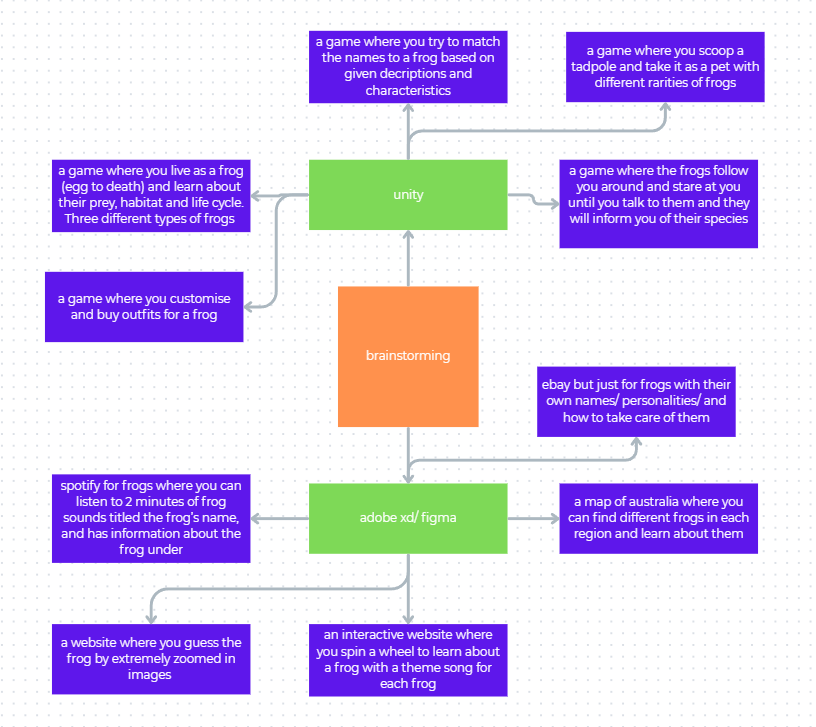

# 10CT-TASK1
Vanessa he
## Project proposal
### Design Brief
### Book Choice and Justification
The book I have chosen in Australian Geographic's "A complete guide to Frogs of Australia", written by SImon Clulow and Mike Swan, image credits on the side of each page.

"Frogs of Australia" provides a detailed account for all 246 recognised species and subspecies (as of 2018), including photographs, distribution maps, characteristics, reproduction, status and more. The encyclopaedia is divided into 5 coloured categories: Australian tree frogs, foam-nesting ground frogs, ground frogs, narrow-mouthed frogs, true frogs, and true toads, visible from the outer edges. The frontmost pages outlines the contents and a brief introduction, while the back has an index and bibliography.

I chose this book after reading and returning my first option (Anomaly) because I found that the topic of frogs seemed more interesting, and would be useful if I ever became a batrachologist. 

### User Experience Type
My project will be an interactive app that is engaging, informative, and aesthetically pleasing. This format enhances the themes of the book by providing audio 

### Target Market
The intended audience is individuals of all ages who have a light interest in frogs and would like to learn about them in short summaries.

### Software and Tools
I plan to use Adobe XD, procreate (for hand-drawn elements) and potentially alight motion to create gifs.

### Initial Brainstorming

## Functional Requirements
### Purpose of the Application
### Use Cases
### Text Cases
## Non-Functional requirements
### Peformance
### Usability
### Reliability
### Security

