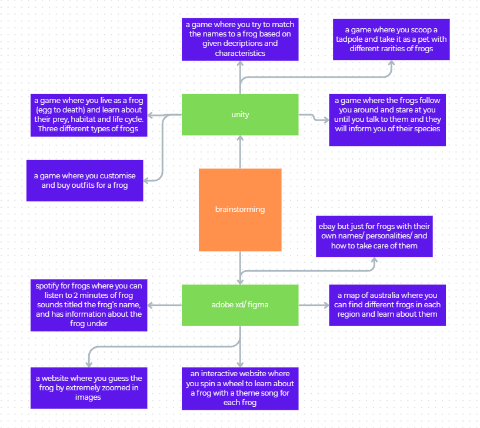

# 10CT-TASK1
Vanessa he
## Project proposal
### Design Brief
My project will be "Croakify", a Spotify inspired app that instead features frog noises in place of songs and informative short summaries under each of their profiles. It will be designed for users of all ages who have a light interest in frogs/animals, offering a fun and exciting way to learn through audio, simple educational content, and interactive elements.

### Book Choice and Justification
The book I have chosen in Australian Geographic's "A complete guide to Frogs of Australia", written by Simon Clulow and Mike Swan.

The encylopaedia provides a detailed account for all 246 recognised species and subspecies (as of 2018), including photographs, distribution maps, characteristics, reproduction, status and more. It is divided into 5 coloured categories, visible from the outer edges: Australian tree frogs, foam-nesting ground frogs, ground frogs, narrow-mouthed frogs, true frogs, and true toads. The frontmost pages outlines the contents and a brief introduction, while the back has an index and bibliography.

I chose this book after reading and returning my first option (Anomaly) because I found that the topic of frogs seemed more interesting, and would be better suited to create an experience out of overall.

### User Experience Type
My project will be an interactive app that is engaging, informative, and aesthetically pleasing. This format enhances the themes of the book by providing an immersive audio experience where users can listen to real demonstrations by Australian frogs. 

### Target Market
While Croakify itself (the app and listening to audio) is available to all ages, users need to have at least primary school reading level to understand given facts and terminology. This project will appeal to the target audience because it allows users to discover and browse through diferent frog species without having to read long paragraphs of scientific text, as in the encyclopaedia.

### Software and Tools

|Chosen software and tools| Explanation |
|---|---|
| Adobe XD | Abobe XD will be used to create the main app/ interface of Croakify as I have already used Figma and would like to try a new platform. Moreover, from my own experience, Figma makes it difficult integrate my own elements and postion them freely. |
| Procreate | Procreate is my main platform when developing hand drawn graphics, and allows exportation in a variety of formats. I will use it to design components such as frog pfps, song covers and the app logo. |
| Alight Motion | Alight Motion will be used to transform transparent pngs from procreate into animated videos (because GIFS are not supported in XD), and is quite easy to use. There are also many alight motion tutorials if I am unsure of what to do (eg. loading screen, image effects). |

### Initial Brainstorming

### Chosen Idea
I chose this idea mainly because of its distinctiveness and suitability according to my timeframe and skillset. Other ideas were either too time consuming or hard to find the tutorials or resources for, which could significantly affect my final project. 
I have already used alight motion and procreate before, which allows me to focus more on developing my app functions and learn Adobe XD rather than, for example, learning how to 3D model for a small game component. 
Furthermore, I wanted to include as much information/relevance from my book as possible, given that it is factual.

## Functional Requirements

### Purpose of the Application
Croakify will inform users on a selection of Australian frogs (around 10-15, depending on time + productivity) through audio and short summaries in a structure similar to Spotify. This app will engage fans within its genre by transforming overly informative and monotonous content into an interactive experience with bite sized details and statistics.

### Use Cases
Identify at least four key user actions:  
- **Selecting songs:** Upon starting the app, the user loads into a playlist where they are able to play and select songs by pressing the song title in an alphabetically arranged frog playlist. 

- **Play/Pause:** When a song is seleted, right side of the screen (half) will show the cover of said song, along with title, singer, progress bar. Under the progress bar, there will be a button that allows users to either play or pause the song. 

- **Singer (frog) profiles**: When users click the singer under the song title, they will be redirected to their profile page with key facts and visuals.

- **Back button:** Users can choose to go back to their previous page with a back button located at the top left side of the screen.

### Text Cases
- **Selecting songs:** Self testing via selecting songs while they are still playing to confirm it changes in both the right side of the screen and in audio. 

- **Play/Pause:** When the pause/play button is selected, the song must stop/play within 0.2- 0.5 seconds along with the change in symbol. (triangle/parallel bars)  
This will be self tested by repeatedly clicking the pause/play button, ensuring it does not lag and responds as intended to player input.

- **Singer (frog) profiles**: 
Self testing by clicking on the singers, confirming that each profile loads/redirects correctly with accurate information and visuals.

- **Back Button:** Asking peers to press the back button for every redirection they encounter while using the app, reporting any errors.

## Non-Functional requirements

### Performance
The app will deliver smooth, reponsive interactions via simple transitions between scenes, expected response to input within 0.5- 1 second (excluding loading into the app), and should not lag, glitch or display the wrong page.

### Usability
I will ensure Croakify will be easy to use by maintaining a consistent layout, colour palette, and clear, universal symbols in my buttons/interactive features. The same font, sizing, and stylisation (bold, italic, underlining) will be used throughout the app, and all text must high contrast with the background and easy to read/identify.

### Reliability
Croakify will be consistent and bug-free through meticulous and regular testing of buttons, functions and correct loading of elements (either self or peer tested). If there is time, I will examine the app across a variety of devices and screen sizes, ensuring that layout, text and media are to proportion and are not cut off the screen. Furthermore, I will certify that information, images and audio are extracted from credible sources such as National Geographic and WWF, and does not includes bias or skewed data.

### Security
Croakify should not collect any information or data, and the user must stay anonymous. However, if the app were to be publsihed and released to the public, it would include an optional log in system with a username, passcode, and email verification, allowing for stream count for each singer and song (when a unqiue user has listened for at least 30 seconds). I would also implement rate limiting to prevent potential bot activity and overload, encrypt sensitive user information restrict and admin access to authorised individuals.

Undergoing regular server check and maintenance would also boost security and obstruct malware and attackers.

## Social, Ethical and Legal Issues

### Social impact: Target Audience Considerations
Although the app is designed for all users, additional considerations will be made to support users with diabilities or accessibility needs so the app is inclusive and easy to use for everyone. These include the use of high contrast colours and fonts, clear and simple navigation, appropriate spacing to avoid accidental clicking and the minimisation of clutter or overwhelming of the screen. 
There will also be warnings placed incase of sensitive or triggering content.

### Social impact: Potential Risks and Benefits

Croakify will postively impact users by creating an enjoyable and memorable learning environment, encouraging curiosity about wildlife and environmental awareness, and inspiring future engagement with conservation topics and exploration beyond the app, especially in younger generations.

However, there are also several potential risks associated with the creation of the app. If information is oversimplified in rephrasing the encyclopaedia or becomes outdated, users may receive inaccurate or misleading details that could result in the mishandling of frogs, disturbance of habitats, or incorrect identification of endangered or toxic species.
Moreover, some frogs may have cultural significance to Indigenous Australians or other communities (eg. the northern corroboree frog as a sacred totem of changing season to the Walgalu people), and using images/data without proper acknowledgement or portrayal could be perceived as disrepectful.

Since Croakify is highly audio based, users with hearing impairments will also be greatly disadvantaged.

### Ethical responsibilities: User Data and Privacy
The app will not collect user data since it does not affect it's functionality and usage, but if it was included later on, I would encrypt data via performing data minimisation, use encryption systems in both rest and transit (eg. AES- 256, TLS) and control who can access personal data, including user verification processes in changing/viewing sensitive information (passwords, user prefs and details). All collection would be transparently stated upon first registration, with clear and consistent policies, and data would be deidentified and destroyed when it is no longer needed or the account is deleted.

### Ethical responsibilities: Representaion, inclusion and content sensitivity
Since the app is mainly informative (exception of frog jokes), there should be no issues with representing the themes, ideas, or species from "Frogs of Australia", especially as most information will be extracted from the book and credible sources.
However, a bibliography (image, videos, information), content warnings (eg. for the names of people who have died included within credits) and thorough external researching on cultural significance and 

idkl 
will be employed to reinforce and responsible handling and containment 
on the topic and 

### Legal considerations

### Researching and planning

### Research Existing UIs

|UI Option| Plus | Minus | Implication|
|---|---|---|---|
| Spotify |  |
| https://a-z-animals.com/ |  |
| Alight Motion | |

### Research Software Options

### Gantt chart

### Feedback: Usability
The wireframes are very clear and structural, with consistent spacing between songs and 
### Feedback: Aesthetics
### Feedback: Functionality

random
Ask specific questions, such as:

Clarity – "Is the layout easy to understand?"

Navigation – "Can you tell how a user would move through this experience?"

Engagement – "Does the design look appealing and engaging for the target audience?"

very celar and strcutures, oc nsistent easy to understand and navigate cus it looks famililiar
l;ikes the back button very intereactive
lieks the frogs are like humans
intuiatave sdesign
uses space very well not overwhelming but fills the page up

maybe put a home buttom so useres dont have to repetitively press back, navigation is easier, the second page is a little spacious so maybe add more on the second page